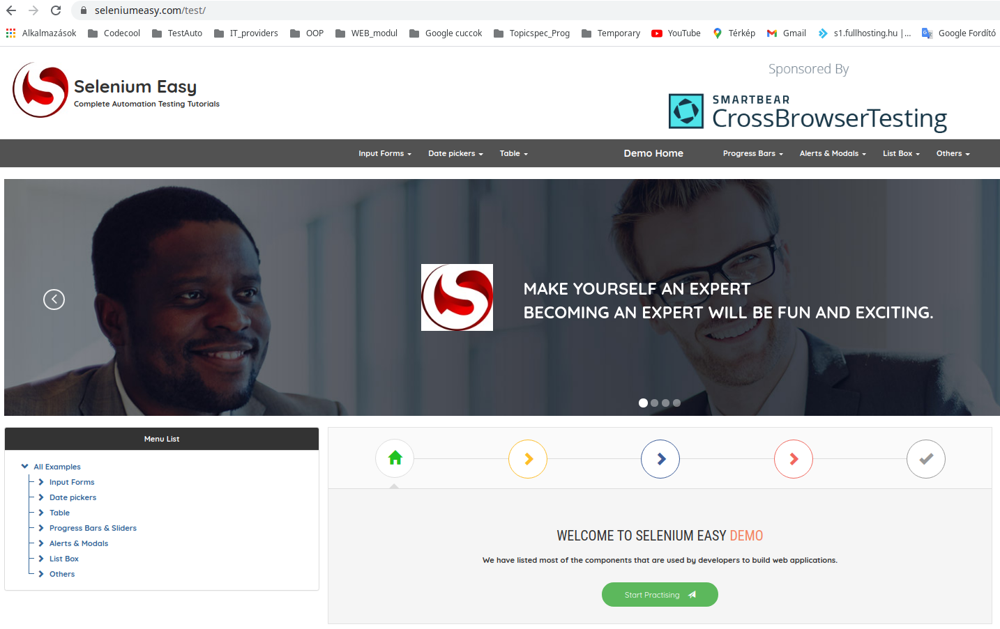

# KDT-DDT-POM-testing-in-java
Automated testing with Keyword Driven-, Data-Driven-, and Page Object Model implementation.

## ABOUT THE PROJECT
 
This project task was given as the first step to learn and implement Selenium-based automated tests with 

1. Keyword Driven Tests; 
2. Data-Driven Tests; 
3. Page Object Model

frameworks.

Tested features of the https://www.seleniumeasy.com/ webpage:

- Navigation
- Single field & Button
- Two fields & Output
- Checkbox
- Select List
- Radio Buttons

 

## Applied technologies

Project SDK: java 11 version 11.09 
Project language level: 16 Records, patterns 
Applied browser: Google Chrome Version:  91.0.4472.106 (64 bit) 
Applied WebDriver: chromedriver 
Data resources format: .csv, .xlsx,  
Applied IDE: IntelliJ IDEA 

## Technical information and set up

Chromedriver have to be saved as 'chromedriver' named file also in the main project folder,
selected for proper version of the browser: https://sites.google.com/a/chromium.org/chromedriver/downloads

The KDT framework has been implemented in two different way: 
1. Excel-based (as the original exercise was defined)
       ./externals/testCases.xlsx
2. JUnit-based
        ./objects/object.properties

## User information

When you run these test suites, the browser has to open and close each test case, to ensure independent test results from each other.

The test cases contain click and type input data into fields of the webpage automatically, and some wait methods for the concerned fields to be clickable.
The lengths of waits were designed in our technical environment (network speed, browser-related WebDriver).

It could happen that sets of these "waits" should be increased by a further 3-5 seconds, due to different environments.

## Story

Lets get back to the roots! Recreate your former tests as a new project, with Keyword-Driven Testing, Data-Driven Testing and POM (implement at least the Extensions tasks for each excercise).

First exercise - Navigation: 
- Open the base url. Using the "Menu List" navigate to All Examples/Input Forms/Simpe Form Demo
- Base url: https://www.seleniumeasy.com/test/
- Extension: Create reusable navigation keyword (and reuse it :])

Second exercise - Single field & Button: 
- Navigate to Simpe Form Demo. In "Single Input Field" enter a message into the field and click "Show Message" button. Validate that the message appeared.
- Extension: fill the field data-driven way, use a source file for it

Third exercise - Two fields & Output: 
- Navigate to Simpe Form Demo. In "Two Input Fields" enter value A and B and click the "Get Total" button. Validate that the answer is correct.
- Does your test works even when you enter very large numbers?
- Extension: use at least 5 rows from data source with expected results, make positive and negative tests (1, a, expected 1a - failing test)

Fourth exercise - Checkbox: 
- Navigate to Checkbox Demo. In "Single Checkbox Demo" check the checkbox and validate the message.
- Bonus if you write a test for "Multiple Checkbox Demo" and find the bug which is present on the webpage.
- Extension: create a data source with at least 5 rows, with input combinations for checkbox (something like 1,0,1,0 should tick the 2nd and 4th checkboxes), dont forget validations

Fifth exercise - Select List: 
- Navigate to Select Dropdown List. In "Select List Demo" select the current day from the dropdown and validate that it's selected.
- Try out all the way you can select a day.
- Extension: select each days after each other twice (14 in total), use keywords and data source obviously

Sixth exercise - Radio Buttons: 
- Navigate to Radio buttons Demo. In "Group Radio Buttons Demo" select a combination and click the "Get values" 
button. Validate the result. 
- Try to run several combinations in one test. 
- Extension: create and validate all possible combinations once, use data source and keywords 